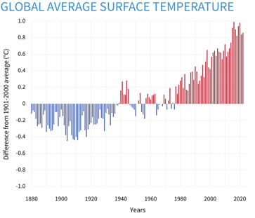
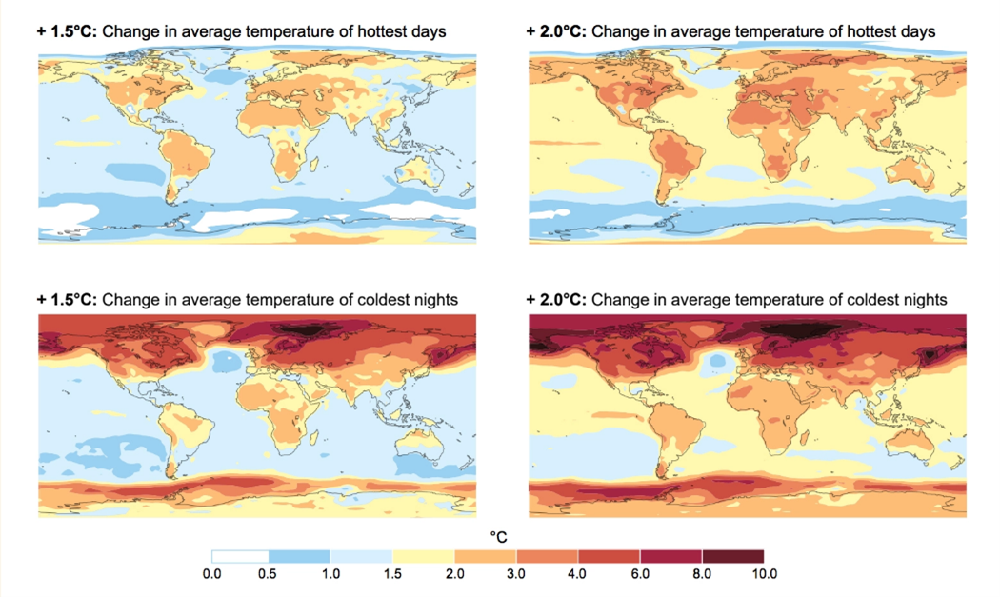
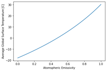

# The Greenhouse effect and Earth's Temperature Model

Climate change is a phenomenon which most people have become very aware of in recent years. Although the Earth is subject to natural warming and cooling cycles, the warming that the planet is experiencing now has been attributed to human intervention, and specifically, the burning of fossil fuels for energy. Through this exercise, we aim to explore this phenomenon, and discover exactly how the Earth's temperature is warming due to this human intervention, what implications it has on the future climate, and how we can lessen the negative impact. 

## The Simplest Climate Model 
In order to understand how the climate is affected by human activity, we need to develop a model of the Earth’s temperature. We’ll start with the simplest case by considering the Earth to be a spherical black body absorbing radiation from the sun. We begin with a radiation balance problem where the energy absorbed by the Earth must be equal to the energy emitted (equation 1)
"\n",
    "```{math}\n",
    ":label: radiationbalance\n",
    "\P_a=P_e\n",
    "```\n",
These terms are further defined by equations 2 and 3 
"\n",
    "```{math}\n",
    ":label: absorbedradiation\n",
    "\P_a=\alpha\cdot S \cdot A_n,
    "```\n",
"\n",
    "```{math}\n",
    ":label: emittedradiation\n",
    "P_e = \epsilon \cdot \sigma \cdot T^4 \cdot A_{tot},
    "```\n",
Where \alpha is the solar absorptivity of the Earth, S is the solar energy reaching the Earth, and A_n is the surface area of the earth which is perpendicular to the sun (i.e. a circular cross section). In equation 3, ε_e is a measure of the emissivity of the earth, σ is the Stefan-Boltzmann constant, T is the temperature of the Earth, and A_tot is the total surface area of the planet (which we will model as a perfect sphere).

**Q1) Using equations 1-3 and the area equations for a circle and a sphere, solve for the temperature of the Earth (T) using algebraic principles.** 

Once solved, the equation should look like this: 
"\n",
    "```{math}\n",
    ":label: BlackBodyTemp\n",
    "T = \left[ \frac {s\alpha} {4\epsilon\sigma}\right ]^{1/4},
    "```\n",
Here, we are assuming the Earth is a black body which means we assume it absorbs all infrared energy. Therefore, the emissivity factor, ϵ may be set equal to 1.
**Q2) Solve this equation using the following values for the constants:**
 
| S | a | ϵ | σ |
| ----------- | ----------- |-----|-----|
| **1370 W/m^2** | **0.3** |   **1**  | **5.67*10^-8** |

After solving this equation, you should see that the temperature of the Earth is around **-18 degrees Celsius**. Intuitively, we know that this number is significantly lower than the real temperature of the earth. This is due to the Greenhouse Effect.

## The Greenhouse Effect

You have likely heard of the Greenhouse Effect in your science courses; it is the reason the surface of the Earth is warm enough to be inhabitable. The atmosphere acts as the walls of a greenhouse, letting the suns energy in while also making it more difficult for it to escape
We will now attempt to account for this effect and change our model to better reflect reality. 
We can refer to the temperature of the earth without an atmosphere and modeled as a black body as T_e (effective emission temperature). If we include another algebraic term which introduces the atmosphere and its effects on trapping heat, we come to the following equation.
"\n",
    "```{math}\n",
    ":label: RadiationWithGreenhouse\n",
    "T = \left[ \frac {s_0\alpha} {4\sigma} \frac{1} {1-\frac {\epsilon_a}{2}}{}\right ]^{1/4},
    "```\n",
Now, look at this equation, and notice the first term in parentheses. You should be able to simplify using Equation 4. Explain the exponent rule which helps you to do this.

After simplifying, you should have gotten the following: 
"\n",
    "```{math}\n",
    ":label: RadiationWithGreenhouse\n",
    "T_s = T_e\left[\frac{1} {1-\frac {\epsilon_a}{2}}{}\right ]^{1/4},
    "```\n",
Here, we see that our original equation has been modified by a term which is dependent on the emissivity of the atmosphere. 

**Q3) Remember that if there was no atmosphere, the temperature would be defined by T_e. Explain/Demonstrate why we can define the Earth’s temperature using equation 4 if the atmosphere didn’t exist (i.e. ϵ=0)**

**Q4) Now given that the emissivity of the atmosphere is 0.78, solve for the true surface temperature of the earth.**

After solving, you will notice that the average temperature of the earth is about **15 degrees Celsius**. This is about 1 degree warmer than the average global temperature in the 20th century, an increase that many climate scientists have contributed to human intervention.



Now while this increase in temperature on the scale of single degrees may not seem significant, it could dramatically affect the global climate. This temperature is representative of the global average, and there is significant range in temperature from the hottest to the coldest places. Although we may experience slight variations in climate, a large portion of the warming is felt by arctic regions near the poles. Large increases in temperatures for these areas can be reflected by smaller increases in the global average.



**Q5) With regards to equation 6, identify the parameter which could cause a change in the global average surface temperature over time. (The surface temperature is a function of what variable?)**

In looking at the equation, you likely identified that the only parameter which human intervention may have effected is ϵ, the emissivity of the atmosphere. 

**Q6) Solve the equation for varying levels of emissivity, and see if you can identify a relationship between the emissivity and the global temperature.**

Notice that as the emissivity approaches 1, the global temperature increases to 30 degrees Celsius. 



**Want to add a last section which implements linear algebra**
