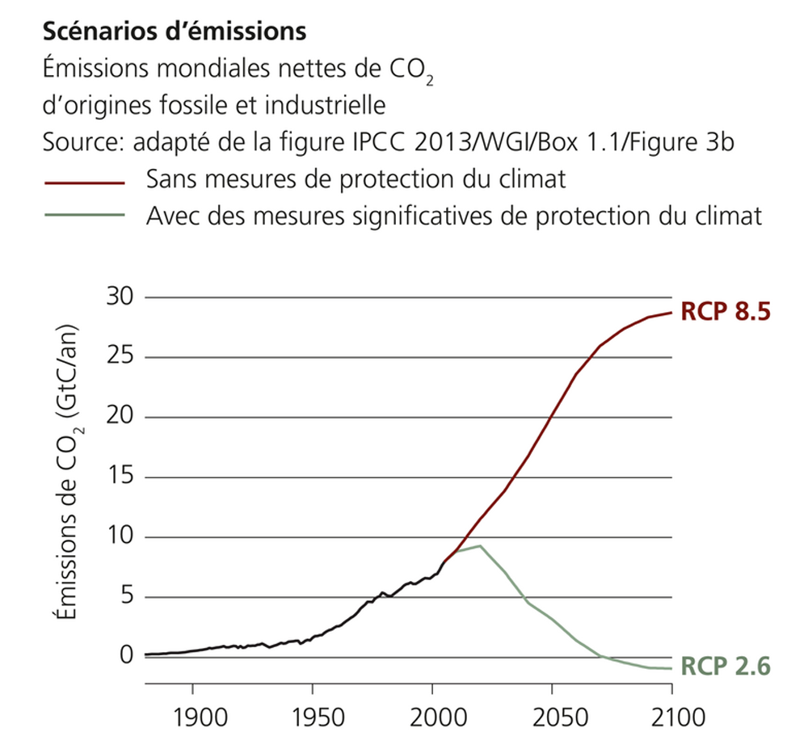
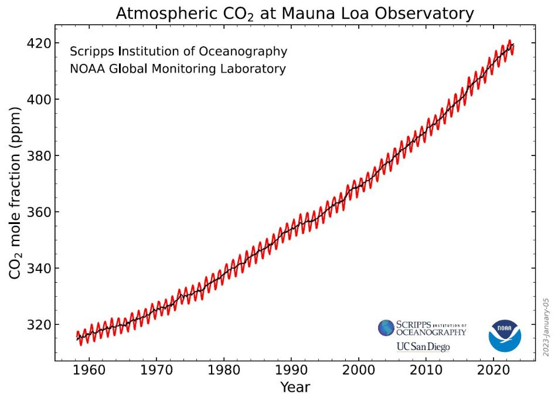

# Suites numériques
# Evolution du carbone dans l'atmosphère

## **Evolution de la quantité de Co2 émise (rapport GIEC 2013)**:

Auteur : Etienne
Sujet : suites numériques

| 1e | 2e | 3e  | 4e  |
| ----------- | ----------- |-----|-----|
| **x** | **x** |     |  |

L’augmentation de la température moyenne à l’échelle de la Terre est directement liée à la quantité de CO2 émise par l’homme. Cette émission est mesurée en GtC/an : Gigatonne de CO2 par an. Le GIEC (Groupe d’Experts Intergouvernemental sur l’évolution du Climat) prévoit deux scénarios pour l’évolution de cette quantité de gaz : soit sans mesures de protection du climat (RCP8.5), soit avec des mesures significatives de protection du climat (RCP2.6) :

 Figure 1 : Évolution de la quantité de CO2 émise à l'échelle du monde, [source](https://www.nccs.admin.ch/nccs/fr/home/changement-climatique-et-impacts/scenarios-climatiques-suisses/comprendre-les-scenarios-climatiques.html#924596455) 

On choisit de modéliser la courbe rouge (RCP 8.5) par une suite numérique $ \left(r_n\right)_{\left(n\in\mathbb{N}\right)} $. On utilisera l’année 2000 comme référence. Notre suite $ \left(r_n\right)_{\left(n\in\mathbb{N}\right)} $ représente donc les émissions telle que $r_0=6$ (Valeur en 2000 :  6 GtC/an) et $r_{100}=29$ (Valeur en 2100 : 29 GtC/an). Plus généralement, pour $n\in \mathbb{N}$, $r_n$ est la valeur de la concentration en C02 en l'année $n-2000$.

1. Entre 2000 et 2060, la suite semble-t-elle être une suite arithmétique ? Une suite géométrique ?

2. Vérifier cette conjecture en calculant les différences et les quotients des différentes valeurs : $r_0=6,25$  (en 2000), $r_{25}=12,5$ (en 2025), $r_{50}=25$ (en 2050)

3. En déduire la raison de cette suite et écrire son terme général.

L’hypothèse précédente ne permet pas de modéliser la courbe après 2065, la partie 2065-2100 ne sera donc pas étudiée.

En 2015, les pays de l’organisation des Nations Unies (ONU) ont voté les accords de Paris. Ce texte prévoit de diminuer les émissions de CO2 de 5% par an en vue de limiter le réchauffement climatique à +2°C en 2100. A partir de 2015, on définit une suite $ \left(v_n\right)_{\left(n\in\mathbb{N}\right)} $ qui représente les émissions prévues selon ce scénario. On a $v_0=9$ (Valeur en 2015 : 9 GtC/an).
Plus généralement, pour $n\in \mathbb{N}$, $v_n$ est la valeur de la concentration en CO2 en l'année $n-2015$.

4. Avec quel type de suite peut-on modéliser une diminution de 5% par an ? Quels seraient ses paramètres ?

5. Avec ces valeurs de la suite, que vaut $v_{60}$ qui correspond à l’année 2075 ?

6. Le graphique montre-t-il une trajectoire de diminution plus forte ou plus faible que les accords de Paris ?

[Source](https://www.nccs.admin.ch/nccs/fr/home/changement-climatique-et-impacts/scenarios-climatiques-suisses/comprendre-les-scenarios-climatiques.html#924596455)

## **Évolution de la quantité de Co2 dans l’air :**  

Auteur : Etienne
Sujet : suites numériques

| 1e | 2e | 3e  | 4e  |
| ----------- | ----------- |-----|-----|
| **x** | **x** |     |  |

L’augmentation de la température moyenne à l’échelle de la Terre est directement liée à la quantité de CO2 émise par l’homme. Une partie du CO2 émis est absorbé par les plantes, une autre par l’océan et l’atmosphère. On peut donc mesurer la quantité de CO2 contenu dans l’air pour suivre l’évolution du climat. Celle-ci se mesure en ppm : partie par millions, par exemple 1 ppm signifie que dans l’air, une molécule sur un million est une molécule de CO2. Voici ce que la station de Mauna Loa (Hawaï) a mesuré entre 1960 et 2020 :

 Figure 1  : CO2 dans l'atmosphère mesuré à Mauna Loa entre 1960 et 2020, [source image](https://gml.noaa.gov/ccgg/trends/) 

1. L’évolution de la courbe noire est-elle linéaire ? On pourra vérifier en traçant une droite sur la figure.

On modélisera la courbe noire par une suite $\left(\mathrm{u}_\mathrm{n}\right)_{\left(\mathrm{n \in N }\right)}\mathrm{\ }$ telle que : $r_0=320$ (Valeur en 1960 :  320 ppm) et $r_{60}=420$ (Valeur en 2020 : 420 ppm).

2. Quel est le terme général de la suite en fonction de sa raison $q$ ?

3. 	Parmi les valeurs suivantes de $q$, laquelle permet d’obtenir une valeur de $r_{60}$ la plus correcte ? $q=0,995$, $q=1,1$, $q=1,0045$, $q=1,05$

4. A combien de pourcents d’augmentation par an correspond cette augmentation ?

D’après Wikipédia « Une étude sur la période 2000–2006 estime que les émissions anthropiques de dioxyde de carbone sont en moyenne absorbées à 45 % dans l'atmosphère, 30 % par la terre et 24 % par les océans. »

5. Comment peut-on estimer en pourcentage l’augmentation de la quantité de CO2 émise à l’échelle mondiale en utilisant le résultat de la question 4 ?

6. D’après le ministère français de la Transition écologique, les émissions mondiales ont augmentées de 0,9% entre 2018 et 2019, cette valeur est-elle cohérente avec la question 4 ?

Remarque 1 : Ces valeurs de CO2 dans l’atmosphère peuvent paraître faibles, mais voici l’augmentation moyenne de température en suisse depuis 1880, on peut en particulier regarder la période 1960-2020 :

[Source image](https://www.meteosuisse.admin.ch/services-et-publications/applications/ext/climate-evolution-series-public.html)
Remarque 2 : On peut commenter le fait que localement, une courbe exponentielle peut ressembler à une droite, surtout si le facteur dans l’exponentiel est très petit.

Source : [données](https://www.meteosuisse.admin.ch/climat/changement-climatique.html)
[Rapport CH18](https://www.nccs.admin.ch/nccs/fr/home/changement-climatique-et-impacts/scenarios-climatiques-suisses/rapport-technique.html)
